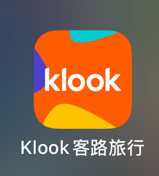

# 准备事项

## App

* 谷歌地图
* Klook

<figure><figcaption>
Klook
</figcaption></figure>

### Others

* [x] 护照
* [x] 身份证
* [x] 签证QRcode
* [x] 流量卡
* [x] 现金
* [x] Suica Card （充值7000日元享受优惠）
* [x] Osaka USJ门票
* [x] Shibuya Sky门票预约（4月19日晚11点开抢5月4日下午门票 3700日元）
